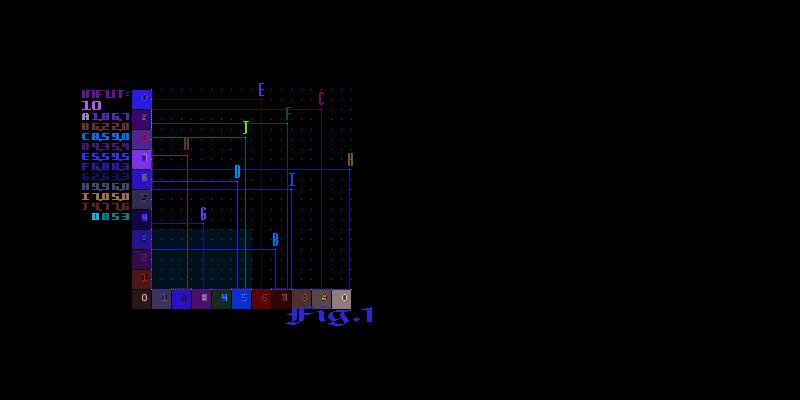
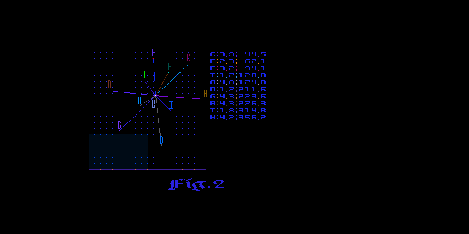
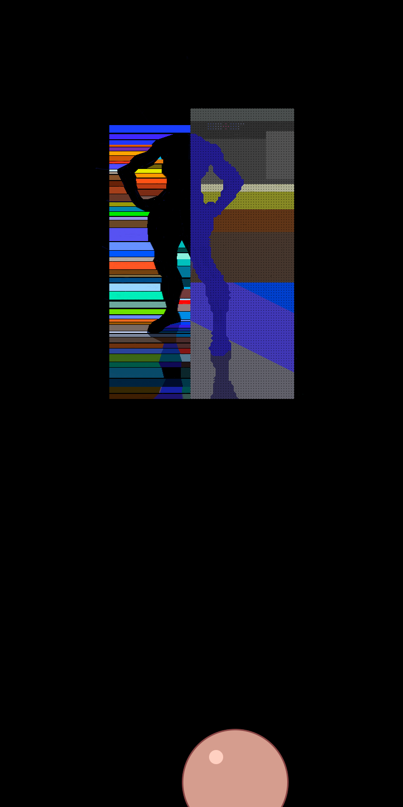

### The Call of the Wild

For me America most of all is a world from the books and films (and
recently from the news on YouTube). To be honest I didn't like
Americans very much because they always have very big opinion about
themselves, but have realized that they are strong, because from the
beginning of their nation are living in the wild. In this difficult times
I would like to give my support to the people of America.

### Trees
Ok, this is the 2nd problem from '91, 
and it's about couple of trees and a house;
[[clck]](https://ioinformatics.org/files/ioi1991round1.pdf).
I suspect the farmer will just take the wire and go around the trees,
without any need of computations, so I've decided more or less to follow that
remarkable idea; the solution is based on sorting, school geometry and circular lists.

OK, here is the infut and how it looks like:
```C++
10
A 1.8 6.7
B 6.2 2.0
C 8.5 9.0
D 4.3 5.4
E 5.5 9.5
F 6.8 8.3
G 2.6 3.3
H 9.9 6.0
I 7.0 5.0
J 4.7 7.6
  0 0 5 3
```



Than from here, we move to the center of mass (com) system. Trees can be
viewed as a list of points in the complex space, namely ``std::complex``, so that
we can use STL build-in functions. Next, having trees' polar co-ordinates we sort
them with respect to their angles:



Now we start loofing counter-clock-wise over the trees and determine geometrically
wheter the current point is inside or outside the triangle formed by the previous
and next points. For example *J* is inside *EYA* and *B* is outside *GYI*. If a
point is inside we remove it from the list until there are no moar points to remove.
The remaining list will represent the desired outside parameter. Here is a sample
dump of the program:
```
Forest:
(A: 1.8, 6.7, rho: 6.93758, phi: 74.9622)
(B: 6.2, 2, rho: 6.5146, phi: 17.8787)
(C: 8.5, 9, rho: 12.3794, phi: 46.6366)
(D: 4.3, 5.4, rho: 6.9029, phi: 51.4698)
(E: 5.5, 9.5, rho: 10.9772, phi: 59.9314)
(F: 6.8, 8.3, rho: 10.7299, phi: 50.673)
(G: 2.6, 3.3, rho: 4.20119, phi: 51.7662)
(H: 9.9, 6, rho: 11.5763, phi: 31.2184)
(I: 7, 5, rho: 8.60233, phi: 35.5377)
(J: 4.7, 7.6, rho: 8.93588, phi: 58.2665)
COM: (Y: 5.73, 6.28, rho: 8.50125, phi: 47.622)
(C: 2.77, 2.72, rho: 3.88218, phi: 44.4782)
(F: 1.07, 2.02, rho: 2.28589, phi: 62.0897)
(E: -0.23, 3.22, rho: 3.2282, phi: 94.0856)
(J: -1.03, 1.32, rho: 1.67431, phi: 127.965)
(A: -3.93, 0.42, rho: 3.95238, phi: 173.9)
(D: -1.43, -0.88, rho: 1.67908, phi: 211.608)
(G: -3.13, -2.98, rho: 4.32172, phi: 223.594)
(B: 0.47, -4.28, rho: 4.30573, phi: 276.267)
(I: 1.27, -1.28, rho: 1.80314, phi: 314.775)
(H: 4.17, -0.28, rho: 4.17939, phi: 356.159)
Rewinding ..
Erasing: (F: 1.07, 2.02, rho: 2.28589, phi: 62.0897)
Erasing: (J: -1.03, 1.32, rho: 1.67431, phi: 127.965)
Erasing: (D: -1.43, -0.88, rho: 1.67908, phi: 211.608)
Erasing: (I: 1.27, -1.28, rho: 1.80314, phi: 314.775)
Forest Guards:
(C: 2.77, 2.72, rho: 3.88218, phi: 44.4782)
(E: -0.23, 3.22, rho: 3.2282, phi: 94.0856)
(A: -3.93, 0.42, rho: 3.95238, phi: 173.9)
(G: -3.13, -2.98, rho: 4.32172, phi: 223.594)
(B: 0.47, -4.28, rho: 4.30573, phi: 276.267)
(H: 4.17, -0.28, rho: 4.17939, phi: 356.159)
Parameter: 23.7612
House Coors:
(U: 0, 0, rho: 0, phi: 0) 1
(V: 5, 0, rho: 5, phi: 0) 1
(W: 5, 3, rho: 5.83095, phi: 30.9638) 0
(X: 0, 3, rho: 3, phi: 90) 1
```



https://youtu.be/mrcgDhpS3uo
